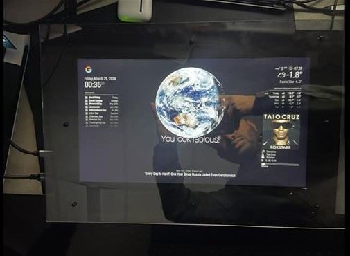

# Smart Mirror Project (Junior Design)

## 🧠 Overview
The **Smart Mirror Project** was developed for **EE 337 – Principles of Engineering Design II (Spring 2024)** at **Minnesota State University, Mankato**.  
Our goal was to design a fully functional smart mirror that merges utility, aesthetics, and smart home integration — creating a sleek interface to display useful information throughout the day.

---

## 🎯 Purpose & Motivation
As modern households become more connected, we aimed to reduce screen clutter by embedding smart functionality into a **mirror** — a device we naturally interact with daily.  
This smart mirror keeps users **informed, connected, and entertained** without disrupting their living space or routine.

---

## 🛠️ System Architecture

### ⚙️ Hardware Components
- **Raspberry Pi 4 Model B** – central processing unit  
- **Two-Way Mirror + LCD Panel** – seamless display integration  
- **PIR Motion Sensor** – detects user presence and controls screen activity  
- **Mini Microphone & Speaker** – enables voice interaction  
- **Custom Frame** – designed for a minimalist, durable form factor

### 💻 Software Stack
- **MagicMirror²** – modular open-source smart mirror framework  
- **Node.js + Electron** – cross-platform desktop environment  
- **Integrated Modules:**
  - `clock` – time display
  - `calendar` – syncs Google Calendar events
  - `currentweather` – real-time weather via OpenWeather API
  - `newsfeed` – scrolling headlines from RSS feeds
  - `compliments` – rotating motivational messages
  - `MMM-NowPlayingOnSpotify` – live Spotify music playback info
  - `MMM-GoogleAssistant` – full voice assistant with voice recognition
- **Custom PIR Wake Routine** – turns screen on/off to conserve energy

---

## 🚀 Features
- **Voice Interaction** via Google Assistant (custom wake phrase + mic input)  
- **Real-Time Weather, Calendar, News** — auto-updates on startup  
- **Spotify Integration** — shows current song, album art, and device  
- **Motion Detection** — screen wakes only when needed  
- **Modular & Expandable** — easily add more MagicMirror modules  

---

## 📽️ Demo
📺 [Click here to watch the Smart Mirror demo video](./Demo%20Video/Demo%20Video.mp4)

---

## 🖼️ Screenshots & Visuals

  
  
  
  
  
<i>Prototype, integration diagram, and block architecture</i>

---

## 📁 Repository Contents

| Folder         | Description                                              |
|----------------|----------------------------------------------------------|
| `Config/`      | Final `config.js` for MagicMirror setup                 |
| `Docs/`        | Final project report and system design documentation    |
| `Images/`      | Hardware build photos, screenshots, wiring diagrams     |
| `Demo Video/`  | Functional video demonstration of the smart mirror      |

---

## 🧪 Challenges & Solutions

| Challenge                            | Solution                                                                 |
|-------------------------------------|--------------------------------------------------------------------------|
| Coordinating APIs & Modules         | Used MagicMirror’s modular setup with custom `config.js`                 |
| Hardware Aesthetics & Stability     | Designed a custom wooden frame with proper venting and cable routing     |
| Energy Efficiency                   | Integrated a PIR sensor to turn the screen off when not in use           |

---

## 🧠 Future Enhancements
- Add **gesture control** for hands-free swipe navigation  
- Expand **voice assistant** to support multilingual and contextual commands  
- Integrate **IoT home devices** (e.g., smart lights, thermostat)  
- Provide **custom themes** and layout options for end-users  

---

## 🔧 Tech Stack

- **Languages:** JavaScript, JSON, Shell scripting  
- **Frameworks:** MagicMirror², Electron  
- **APIs:** OpenWeather API, Spotify Web API, Google Assistant SDK  
- **Hardware:** Raspberry Pi 4, PIR sensor, 2-way mirror, USB mic/speaker

---

## 👥 Contributors

- **Dagmawi Abera** – Project Manager, Hardware Integration, Assistant Config, Voice UI  
- **Hamede Abdulgafur** – Software Engineer, Module Integration, Testing  
- **Noah Awol** – Hardware Systems, Sensor Wiring, Frame Construction

---

## 📄 License

This project is licensed under the **MIT License** for educational and portfolio purposes.

